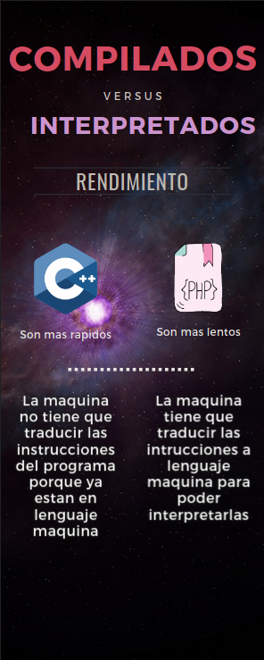
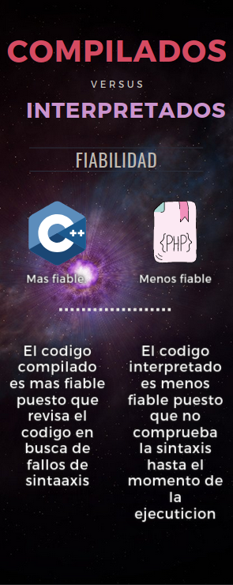
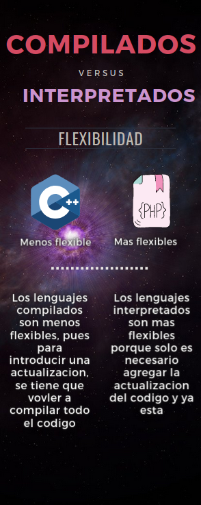
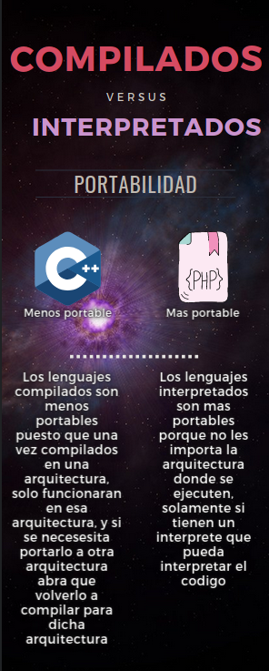

# Entornos de Desarrollo
## UT01: Introducción al desarrollo de Software Compiladores, intérpretes y transpiladores
### Objetivos
-  Ampliar los conocimientos sobre diferentes tecnologías de generación de código
### Elementos necesarios
- Ordenador con acceso a Internet
- LibreOffice Writer
### Instrucciones
Esta actividad se hará de forma individual. Responde sobre el propio documento.
Tiempo estimado: 1-2 sesiones
### Actividad 1: Comparando lenguajes compilados, virtuales e interpretados
1. Diseña una infografía que compare lenguaje compilados con lenguajes interpretados desde varios puntos de vista: el rendimiento, la fiabilidad de detección de errores, la flexibilidad del lenguaje y la portabilidad.

2. Hemos hecho un programa con un lenguaje interpretado y lo queremos distribuir. ¿Que necesitará un usuario que quiera ejecutar nuestro programa en su ordenador? Argumenta la respuesta.
- El usuario solo necesitara un interprete, puesto que el programa no necesita nada mas para funcionar, puesto que no se tiene que compilar
3. Tu programa está compuesto por dos ficheros de código fuente A y B. Ejecutas el programa y mientras está ejecutando instrucciones del fichero de código fuente A ves que hay un error de programación en el fichero B y modificas ese fichero. Compara cómo harías para que se ejecute el programa con el cambio que acabas de hacer en un compilador o en un intérprete.
- En un programa interpretado no tendria que hacer nada puesto que comforme lo modificara el interprete lo interpretaria y ya esta.
- En un programa compilado tendria que vovler a compilar el archivo B para que funcionara.

Actividad 2: Compiladores, intérpretes y...transpiladores
Investiga y responde a las siguientes preguntas:
1. ¿Qué es un transpilador?
- Es un tipo especial de compilador que interpretando codigo fuente, genera codigo fuente en otro lenguaje con abstraccion parecida al codigo fuente anterior
2. ¿Cuál es la principal diferencia de un transpilador con un compilador?
- Un compilador convierte el codigo fuente en codigo maquina, mientras que el transpilador lo convierte en otro lenjuage en codigo fuente
3. Cita ejemplos de lenguajes actuales que usen un transpilador.

| Nombre | Lenguaje_fuente | Lenguaje_destino |
| :---: | :---: | :---: |
| Cfront | C++ | C |
| HipHop | PHP | C++ |
| JSweet |Java |TypeScript |
| J2ObjC | Java | Objective-C |
